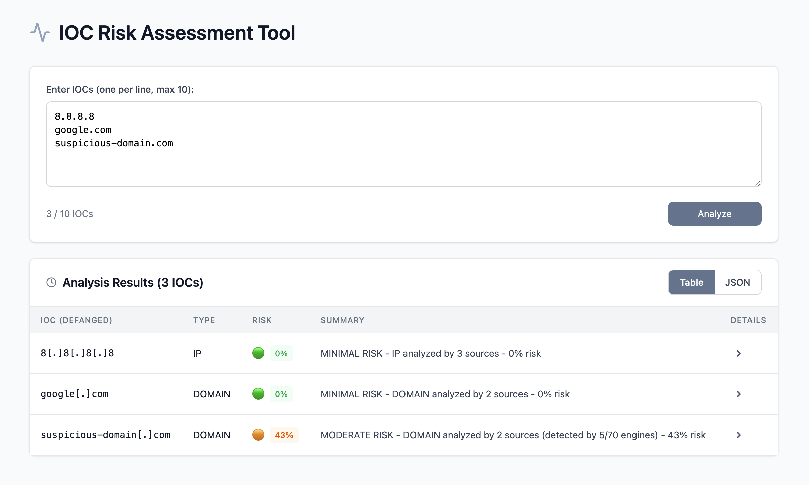
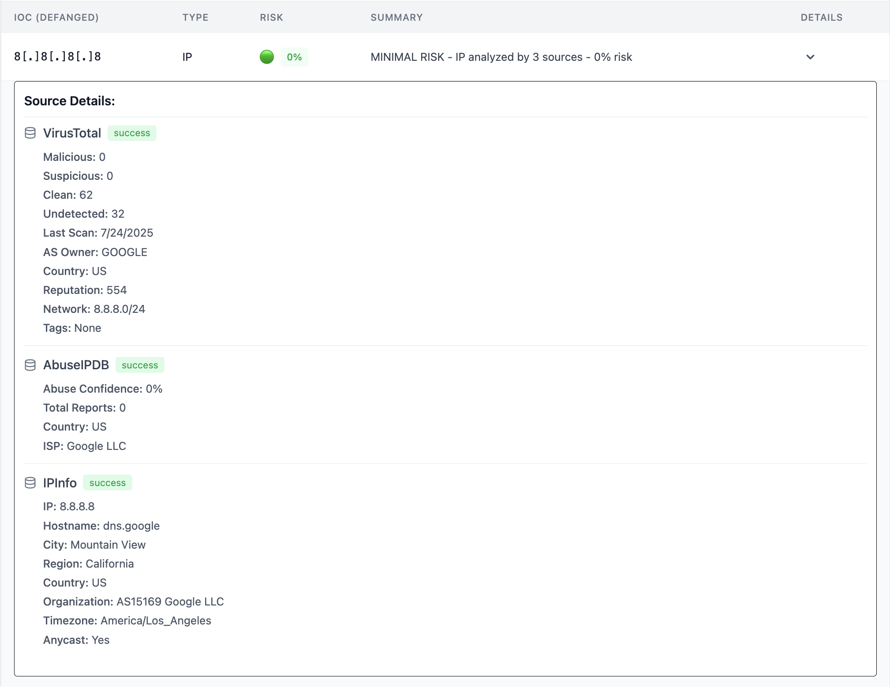

# IOC Risk Assessment Tool

A risk assessment tool that analyzes Indicators of Compromise (IOCs) and provides real-time security scoring. It analyzes IPs, domains, or file hashes and produces an aggregated, weighted risk assessment, reducing the need to manually cross‑check against multiple threat intelligence sources.



_Example analysis using a mocked malicious domain for demonstration purposes._

## ⚡ Key Features

- **Multi-Source Intelligence** - Integrates VirusTotal, AbuseIPDB, and IPInfo APIs
- **Intelligent Risk Scoring** - Weighted algorithm combining detection rates and contextual data
- **Bulk Analysis** - Parallel API calls across multiple sources
- **Responsive Design** - Optimized for desktop and mobile devices

## 🛠️ Tech Stack

- **Backend:** FastAPI, Python 3.9+, Pydantic
- **Frontend:** React, JavaScript, Vite, Tailwind CSS
- **APIs:** VirusTotal, AbuseIPDB, IPInfo
- **Deployment:** Render

## 🚀 Live Demo

⚠️ **Note:** This tool uses free tier APIs - multiple IOCs will be processed slowly due to rate limiting.

**Try it now:** https://ioc-risk-assessment.onrender.com/

## 🔍 Detailed Analysis Results



## 📋 Example Response

```
  {
    "ioc": "suspicious-example.com",
    "ioc_type": "domain",
    "risk_score": 65,
    "summary": "HIGH RISK - DOMAIN analyzed by 3 sources (detected by 8/70 engines) - 65% risk",
    "sources": [
      {"source": "VirusTotal", "status": "success", "data": {"Malicious": "8", "Clean": "55"}},
      {"source": "AbuseIPDB", "status": "success", "data": {"Abuse Confidence": "75%"}},
      {"source": "IPInfo", "status": "success", "data": {"Country": "RU", "Organization": "Bulletproof Hosting"}}
    ]
  }
```

## 🎯 Risk Scoring Algorithm

The tool uses a weighted multi-source risk assessment:

- **VirusTotal (60%)** - Malware detection rates from 50+ antivirus engines
- **AbuseIPDB (30%)** - Abuse confidence percentage for IPs
- **IPInfo (10%)** - Contextual risk factors (hosting type, geolocation)

## ⚖️ Risk Levels

- 🟢 MINIMAL RISK (0-14) - Clean indicators, no detections
- 🟡 LOW RISK (15-39) - Few detections, monitoring recommended
- 🟠 MODERATE RISK (40-69) - Multiple detections, investigation needed
- 🔴 HIGH RISK (70-100) - Strong malicious indicators, immediate action required

_For detailed scoring logic, see [risk_scoring.py](backend/app/risk_scoring.py)_

## 📊 Supported IOC Types

| Type       | Example                                    | Detection Method             |
| ---------- | ------------------------------------------ | ---------------------------- |
| **IPv4**   | `192.168.1.1`                              | Regex pattern validation     |
| **Domain** | `malicious.com`                            | DNS pattern + TLD validation |
| **MD5**    | `5d41402abc4b2a76b9719d911017c592`         | 32 hex characters            |
| **SHA1**   | `adc83b19e793491b1c6ea0fd8b46cd9f32e592fc` | 40 hex characters            |
| **SHA256** | `e3b0c44298fc1c149afbf4c8996fb924...`      | 64 hex characters            |

**Source Coverage:**

- **IP Addresses** - Analyzed by all sources
- **Domains** - Analyzed by VirusTotal and IPInfo
- **File hashes** - Analyzed by VirusTotal
